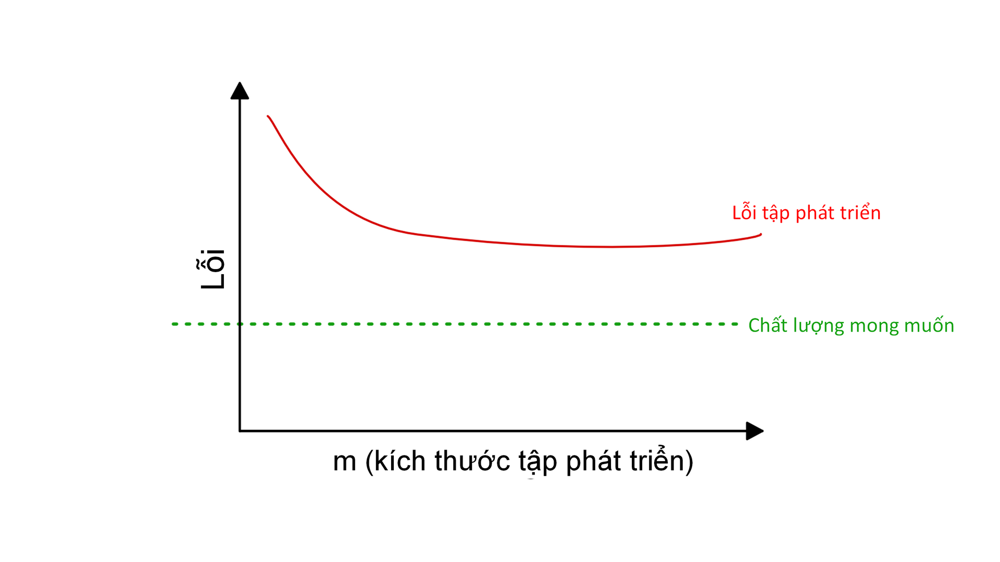
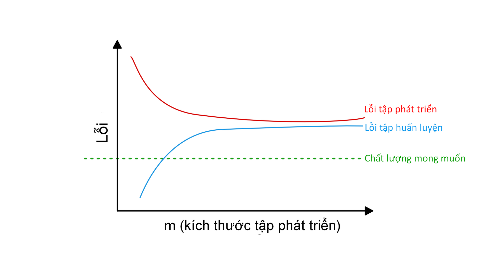

> # 30. Interpreting learning curves: High bias

--> # 30. Hiểu rõ [thông hiểu/giải thích] đồ thị quá trình học: Độ chệch cao

> Suppose your dev error curve looks like this:

--> Giả sử đường cong sai số của tập phát triển thu được hình sau:

> We previously said that, if your dev error curve plateaus, you are unlikely to achieve the desired performance just by adding data.

--> Như ta đã thảo luận, nếu đường cong sai số của tập phát triển trải dài và bằng phẳng [cần tìm từ khác?], việc chỉ thêm dữ liệu sẽ không thể đem về hiệu suất mà ta mong đợi. 

> But it is hard to know exactly what an extrapolation of the red dev error curve will look like. If the dev set was small, you would be even less certain because the curves could be noisy.

--> Tuy nhiên, sẽ thật khó để dự đoán chính xác đường cong màu đỏ thể hiện sai số của tập phát triển sẽ trông như thế nào. Trong trường hợp tập phát triển nhỏ, việc dự đoán chính xác sẽ càng trở nên khó khăn vì khi đó đường cong này sẽ có khả năng bị nhiễu. 

> Suppose we add the training error curve to this plot and get the following:

--> Giả sử chúng ta thêm đường cong sai số của tập huấn luyện vào biểu đồ này, thu được hình sau:

> Now, you can be absolutely sure that adding more data will not, by itself, be sufficient. Why is that? Remember our two observations:

--> Lúc này, bạn có thể hoàn toàn chắc chắn việc thêm chỉ thêm dữ liệu sẽ không đủ [add để tăng hiệu suất?]. Tại sao vậy? Hãy nhớ hai quan sát [phân tích] sau:

> * As we add more training data, training error can only get worse. Thus, the blue training error curve can only stay the same or go higher, and thus it can only get further away from the (green line) level of desired performance.

--> Khi chúng ta thêm dữ liệu huấn luyện, sai số trong huấn luyện chỉ có thể tệ đi [tăng lên?]. Vì vậy, đường cong màu xanh dương thể hiện sai số huấn luyện chỉ có thể giữ nguyên hoặc đi lên và do đó nó chỉ có thể đi xa hơn hiệu suất mong muốn(được thể hiện bởi màu xanh lục).

> * The red dev error curve is usually higher than the blue training error. Thus, there’s almost no way that adding more data would allow the red dev error curve to drop down to the desired level of performance when even the training error is higher than the desired level of performance.

--> Đường cong màu đỏ thể hiện sai số của tập phát triển thường cao hơn so với đường cong màu xanh thể hiện sai số trong tập huấn luyện. Vì vậy, hầu như không có cách nào để thêm dữ liệu sao cho đường cong sai số giảm xuống mức hiệu suất mong muốn khi ngay cả sai số trong huấn luyện cũng cao hơn mức mong muốn đó.

> Examining both the dev error curve and the training error curve on the same plot allows us to more confidently extrapolate the dev error curve.

--> Kiểm tra [phân tích] cả đường cong sai số của tập phát triển lẫn đường cong sai số của tập huấn luyện trong cùng một đồ thị cho phép chúng ta tự tin có những suy đoán [phép ngoại suy] về đường cong của tập phát triển [lặp từ]. 

> Suppose, for the sake of discussion, that the desired performance is our estimate of the optimal error rate. The figure above is then the standard “textbook” example of what a learning curve with high avoidable bias looks like: At the largest training set size—presumably corresponding to all the training data we have—there is a large gap between the training error and the desired performance, indicating large avoidable bias. Furthermore, the gap between the training and dev curves is small, indicating small variance.

--> Để thảo luận, giả sử hiệu suất mong muốn chính là ước tính cho tỉ lệ lỗi tối ưu. Đồ thị trên trở thành ví dụ chuẩn "sách giáo khoa" về một đồ thị quá trình học với độ chệch cao có thể tránh [avoidable bias?] sẽ trông như thế nào: Tại điểm tập huấn luyện có kích cỡ lớn nhất -[có lẽ] tương ứng với tất cả dữ liệu trong tập huấn luyện - có một khoảng cách lớn giữa sai số huấn luyện và hiệu suất mong muốn, dấu hiệu của độ chệch có thể tránh được[avoidable bias?]. Hơn nữa, tại điểm này, khoảng cách giữa đường cong huấn luyện và đường cong phát triển nhỏ, dấu hiệu của phương sai bé. [đoạn này khá lủng củng]

> Previously, we were measuring training and dev set error only at the rightmost point of this plot, which corresponds to using all the available training data. Plotting the full learning curve gives us a more comprehensive picture of the algorithms’ performance on different training set sizes.

--> Trước đó, chúng ta chỉ đo sai số của tập huyến luyện và sai số của tập phát triển tại điểm ngoài cùng bên phải của đồ thị, tương ứng với việc sử dụng hết dữ liệu trong tập huấn luyện. Vẽ đầy đủ đồ thị quá trình học sẽ cho chúng ta một cái nhìn tổng thể hơn về hiệu suất của những thuật toán trên các kích cỡ khác nhau của tập huấn luyện. [dịch lại câu này]
